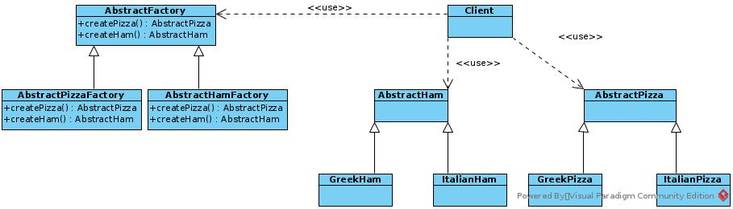

# Abstract Factory

## Use Case
Consider a situation where you want to create a different type of pizza depending on the type that is requested. The pizza has different type of ingredients for every type of pizza. By defining an abstract factory we can create a family of classes that relate to each other and can be used together by being called by the same factory. So we define a different factory for each family of products that we want to get created. It is important that the products have a 1-1 relationship in each factory so that they can be used interchangably.

## UML

## General Usage

You can use the abstract factory method when:
- You need to have interchangable families of items. *(GreekFamily, ItalianFamily)*
- You need to enforce a relationship between items. *(Relationship between ItalianHam, ItalianPizza)*.

Abstract factory let's us define in this specific case different types of pizzas